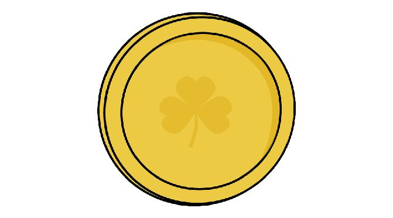

# iiinception

The aim of the project is to build a maze game based over the IIT-Delhi Campus which gives a compelling experience to the user.

## Requirements
* This program requires the SDL2 library, along with SDL2_image, SDL2_mixer, SDL2_ttf.
* Instructions to download required libraries are explained in detail in this [link](https://lazyfoo.net/tutorials/SDL/01_hello_SDL/index.php).
* Make command in the terminal.

## Instructions
To play the game, follow the following instructions.
* Clone the repo in your system.
* Type `$ make` in the project directory in the terimanl to compile main.cpp.
* If you are a server use the command `$ ./game s` to host the server for client.
* If you are a client then use the command `$ ./game c <ip_addr>` after the server has hosted the network, where <ip_addr> is the ip address of the client.
* Further details of gameplay can be found in ` .iiinception/gameplay.pdf`.

## Objective

The objective of the game is to meet with your COP290 teammate at 3 random location chosen by your teammate, while doing some tasks that he asks you to do. Make sure you reach to the location in time otherwise your teammate will complain to ma'am that you don't contribute to the project! Collect coins and eat food at mess to gain health and complete the project before your friend to get more points. The end points are decided by the quality of the project and bonus points for being the first person to give the demo. 
You can also earn bonus points by being a good human being and putting the garbage on the roads into the trashcans nearby!

## Assets

### Coins
<!--  -->

Pick coins to earn money and be more productive, and eat better!

### Giftbox
<!--  -->

Pick giftbox to earn random but low points!

### Garbage
<!--  -->

Pick garbage and throw in trashcans to earn bonus points for cleaning the campus!

### Trashcans
<!--  -->

Pick garbage and throw in trashcans to earn bonus points for cleaning the campus!

### Angry Professor
<!--  -->

Make sure to avoid angry professors otherwise they will lower your (mental) health!

## Useful Links
* To get the complete details of the project see [Task2 - SubTask1](https://www.cse.iitd.ac.in/~rijurekha/cop290_2022.html)
* For SDL tutorials we used [Lazy Foo Tutorials](https://lazyfoo.net/tutorials/SDL/index.php) and the [Youtube Playlist](https://www.youtube.com/watch?v=QQzAHcojEKg&list=RDCMUCAM9ZPgEIdeHAsmG50wqL1g&start_radio=1&rv=QQzAHcojEKg&t=0)
* For socket programming we reffered the [article](https://www.geeksforgeeks.org/socket-programming-cc/)
* In resources we used the following links for [icons](https://www.iconsdb.com/), [font](https://www.1001freefonts.com/), [sounds](https://www.soundjay.com/), [tilesets](https://www.vecteezy.com/free-vector/isometric-city), [image editing](https://www.remove.bg/upload).

